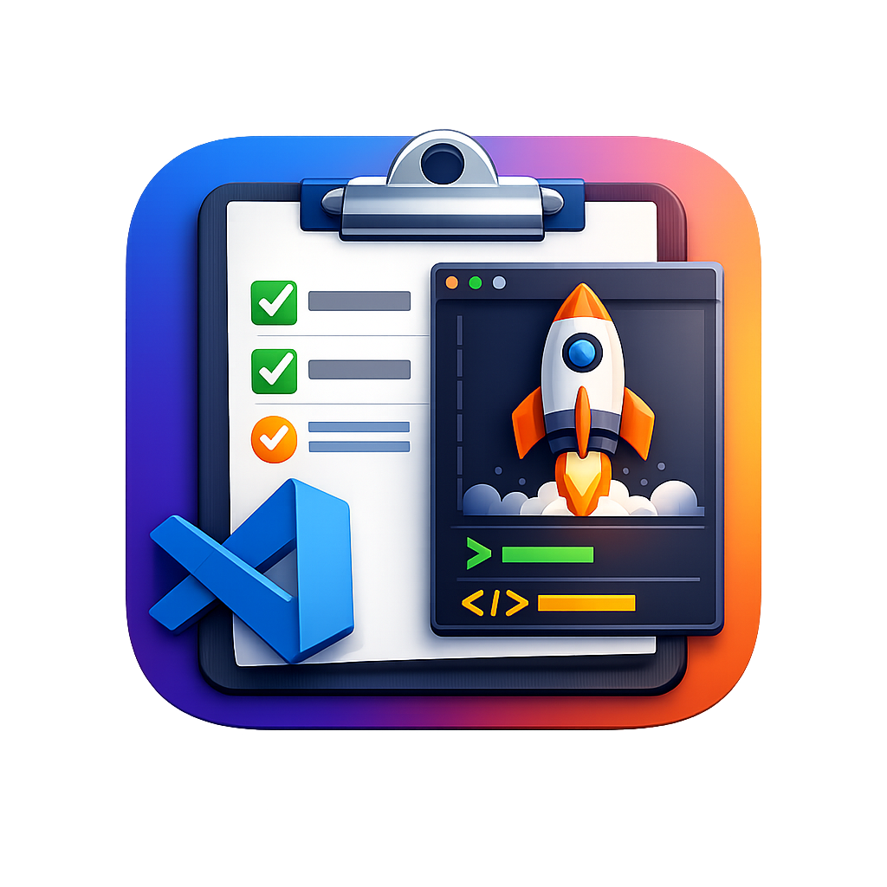

# Better Run

<div align="center">
  
</div>

> **Note**: If the icon doesn't show up, reload the window (`Cmd+R` on macOS, `Ctrl+R` on Windows/Linux, or use the Command Palette: "Developer: Reload Window").

**Better Run** is a VS Code/Cursor extension that organizes and manages debug launches and tasks from multiple sources in a unified tree view. It helps you quickly access and run configurations from workspace files, user settings, and more.

## Features

- 🌳 **Unified Tree View**: Browse all your launches, tasks, and notebooks in one organized view
- 📁 **Multi-Source Support**: Automatically discovers launches and tasks from:
  - Workspace `.vscode/launch.json` files
  - Workspace `.vscode/tasks.json` files
  - User settings (global launches and tasks)
- 📓 **Notebook Support**: Discover and open Jupyter notebooks from workspace and user settings
- 🏷️ **Smart Task Categorization**: Automatically categorizes tasks using pattern matching rules
- 🔍 **Search & Filter**: Quickly find launches, tasks, and notebooks by name
- ⚡ **Quick Actions**: Run, debug, or execute tasks directly from the tree view with inline buttons
- 🖱️ **Double-Click to Run**: Double-click any launch or task to execute it
- ⌨️ **Keyboard Shortcuts**: Quick rerun/redebug of last executed items
- 🐍 **Python venv Support**: Attach virtual environments to Python launches and tasks
- 📝 **Editor Integration**: Right-click editor tabs to quickly create and run launches
- 🔄 **Auto-Refresh**: Automatically updates when configurations change

## Installation

1. Open VS Code or Cursor
2. Go to the Extensions view (`Cmd+Shift+X` on macOS, `Ctrl+Shift+X` on Windows/Linux)
3. Search for "Better Run"
4. Click **Install**

Alternatively, you can install from a `.vsix` file:
```bash
code --install-extension better-run-0.0.1.vsix
```

## Usage

### Accessing the View

After installation, you'll see a new **Better Run** icon in the Activity Bar. Click it to open the "Runs" view.

### Tree Structure

The view organizes items hierarchically:

```
Workspace Name
├── Launches
│   ├── launch.json
│   │   ├── Launch Configuration 1
│   │   └── Launch Configuration 2
│   └── User settings
│       └── User Launch 1
├── Tasks
│   ├── Task without category (top-level)
│   ├── Category Name
│   │   ├── tasks.json
│   │   │   ├── Task 1
│   │   │   └── Task 2
│   │   └── User settings
│   │       └── User Task 1
│   └── Another Category
│       └── ...
└── Notebooks
    ├── notebook1.ipynb
    ├── notebook2.ipynb
    └── ...
```

### Running Launches

- **Double-click**: Double-click a launch to run it (without debugging)
- **Inline Buttons**: Use the Run (▶️) and Debug (🐛) buttons next to each launch
- **Context Menu**: Right-click a launch for options:
  - **Run**: Run the launch without debugging
  - **Debug**: Debug the launch
  - **Attach venv**: Attach a Python virtual environment (Python launches only)
  - **Go to Settings Definition**: Open the file where the launch is defined

### Running Tasks

- **Double-click**: Double-click a task to execute it
- **Inline Button**: Use the Run (▶️) button next to each task
- **Context Menu**: Right-click a task for options:
  - **Run**: Execute the task
  - **Attach venv**: Attach a Python virtual environment (Python tasks only)
  - **Go to Settings Definition**: Open the file where the task is defined
- Tasks from `tasks.json` are executed via VS Code's task system
- Tasks from user settings are executed in a terminal

### Opening Notebooks

- **Click**: Click a notebook to open it in the default notebook editor
- Notebooks are displayed with a Jupyter icon (🟠)

### Search & Filter

1. Click the **Search** icon (🔍) in the view title bar
2. Enter a search term (case-insensitive)
3. The tree will filter to show only matching launches and tasks
4. Click **Clear** (✕) to remove the filter

### Keyboard Shortcuts

- `Cmd+Shift+\` (macOS) or `Ctrl+Shift+\` (Windows/Linux): Collapse all items in the view
- `Ctrl+Shift+R` (Mac: `Cmd+Shift+R`): Rerun last task
- `Ctrl+Shift+L` (Mac: `Cmd+Shift+L`): Rerun last launch
- `Ctrl+Shift+D` (Mac: `Cmd+Shift+D`): Re-debug last launch

**Note**: The rerun and redebug commands share the same pool - they both use the most recently run or debugged launch.

### Editor Tab Integration

Right-click on any editor tab (except markdown/plaintext files) to access:

- **Run File as Launch**: Creates a launch configuration for the current file (if it doesn't exist) and runs it
- **Debug File as Launch**: Creates a launch configuration for the current file (if it doesn't exist) and debugs it

The extension automatically detects the file type (Python, Node.js, Go, Rust, Java, etc.) and creates an appropriate launch configuration.

### Refresh

Click the **Refresh** icon (🔄) in the view title bar to manually reload all launches, tasks, and notebooks.

## Configuration

Better Run can be configured through VS Code/Cursor settings. Open your settings (`Cmd+,` or `Ctrl+,`) and search for "Better Run".

### `betterRun.userLaunches`

Define launch configurations that will be available globally across all workspaces.

**Type**: `array`  
**Default**: `[]`

Each item should be a valid VS Code launch configuration object.

**Example**:
```jsonc
{
  "betterRun.userLaunches": [
    {
      "name": "Python: Current File",
      "type": "python",
      "request": "launch",
      "program": "${file}",
      "console": "integratedTerminal",
      "justMyCode": true
    },
    {
      "name": "Node: Current File",
      "type": "node",
      "request": "launch",
      "program": "${file}",
      "console": "integratedTerminal"
    }
  ]
}
```

### `betterRun.userTasks`

Define tasks that will be available globally across all workspaces.

**Type**: `array`  
**Default**: `[]`

Each item should include:
- `label` (required): The task name
- `command` (required): The command to execute
- `type` (optional): Task type, typically `"shell"`
- `cwd` (optional): Working directory for the task
- `category` (optional): Manual category assignment (overrides automatic categorization)

**Example**:
```jsonc
{
  "betterRun.userTasks": [
    {
      "label": "Alembic: upgrade head",
      "type": "shell",
      "command": "alembic upgrade head",
      "category": "Database"
    },
    {
      "label": "Format: ruff",
      "type": "shell",
      "command": "ruff format .",
      "category": "Code Quality"
    },
    {
      "label": "Run tests",
      "type": "shell",
      "command": "pytest",
      "cwd": "${workspaceFolder}"
    }
  ]
}
```

### `betterRun.taskCategoryRules`

Define rules to automatically categorize tasks based on their label using regular expressions.

**Type**: `array`  
**Default**: 
```jsonc
[
  {
    "category": "Alembic",
    "pattern": "\\balembic\\b"
  },
  {
    "category": "Tests",
    "pattern": "\\b(test|tests|pytest|unittest|nose)\\b"
  },
  {
    "category": "Code Quality",
    "pattern": "\\b(mypy|ruff|flake8|pylint|black|isort)\\b"
  }
]
```

Rules are evaluated in order, and the **first match wins**. Patterns are case-insensitive.

**Example**:
```jsonc
{
  "betterRun.taskCategoryRules": [
    {
      "category": "Database",
      "pattern": "\\b(alembic|migrate|migration|db:|database)\\b"
    },
    {
      "category": "Testing",
      "pattern": "\\b(test|spec|pytest|jest|mocha|vitest)\\b"
    },
    {
      "category": "Linting",
      "pattern": "\\b(lint|eslint|pylint|ruff|mypy|flake8)\\b"
    },
    {
      "category": "Formatting",
      "pattern": "\\b(format|prettier|black|isort)\\b"
    }
  ]
}
```

**Note**: If a task label matches the pattern `^Category: ...`, it will automatically use "Category" as the category name, even without a matching rule.

### `betterRun.taskCategoryByLabel`

Map specific task labels to categories. This takes precedence over `taskCategoryRules`.

**Type**: `object`  
**Default**: `{}`

**Example**:
```jsonc
{
  "betterRun.taskCategoryByLabel": {
    "build": "Build",
    "deploy": "Deployment",
    "custom: my task": "Custom"
  }
}
```

### `betterRun.userNotebookPaths`

Define paths to Jupyter notebooks that will be available globally across all workspaces.

**Type**: `array`  
**Default**: `[]`

Paths can be absolute or relative to the workspace. They can point to individual `.ipynb` files or directories containing notebooks.

**Example**:
```jsonc
{
  "betterRun.userNotebookPaths": [
    "/absolute/path/to/notebook.ipynb",
    "~/notebooks",
    "relative/path/to/notebooks"
  ]
}
```

**Note**: For workspace-specific notebooks, use `.vscode/notebooks.json` instead.

## Complete Configuration Example

Here's a comprehensive example combining all configuration options:

```jsonc
{
  "betterRun.userLaunches": [
    {
      "name": "Python: Debug Current File",
      "type": "python",
      "request": "launch",
      "program": "${file}",
      "console": "integratedTerminal",
      "justMyCode": true
    }
  ],
  "betterRun.userTasks": [
    {
      "label": "Database: Migrate",
      "type": "shell",
      "command": "alembic upgrade head",
      "category": "Database"
    },
    {
      "label": "Format Code",
      "type": "shell",
      "command": "ruff format . && ruff check --fix ."
    }
  ],
  "betterRun.userNotebookPaths": [
    "~/notebooks",
    "/absolute/path/to/notebook.ipynb"
  ],
  "betterRun.taskCategoryRules": [
    {
      "category": "Database",
      "pattern": "\\b(alembic|migrate|migration|db:)\\b"
    },
    {
      "category": "Tests",
      "pattern": "\\b(test|pytest|jest|spec)\\b"
    },
    {
      "category": "Code Quality",
      "pattern": "\\b(lint|format|ruff|mypy|black|isort)\\b"
    }
  ],
  "betterRun.taskCategoryByLabel": {
    "build": "Build",
    "deploy: production": "Deployment"
  }
}
```

## How It Works

### Launch Sources

Better Run discovers launch configurations from:

1. **Workspace `launch.json`**: Each workspace folder's `.vscode/launch.json` file
2. **User Settings**: Launch configurations defined in `betterRun.userLaunches`

The extension looks for user settings in:
- `~/Library/Application Support/Cursor/User/settings.json` (macOS, Cursor)
- `~/Library/Application Support/Code/User/settings.json` (macOS, VS Code)

### Task Sources

Better Run discovers tasks from:

1. **Workspace `tasks.json`**: Each workspace folder's `.vscode/tasks.json` file
2. **User Settings**: Tasks defined in `betterRun.userTasks`

### Notebook Sources

Better Run discovers Jupyter notebooks from:

1. **Workspace `notebooks.json`**: Each workspace folder's `.vscode/notebooks.json` file
   - Create a `.vscode/notebooks.json` file in your workspace with a `paths` array
   - Paths can be absolute or relative to the workspace root
   - Paths can point to individual `.ipynb` files or directories containing notebooks
   - Example:
     ```json
     {
       "paths": [
         "/absolute/path/to/notebook.ipynb",
         "relative/path/to/notebook.ipynb",
         "/absolute/path/to/notebooks/directory",
         "relative/path/to/notebooks/directory"
       ]
     }
     ```
2. **User Settings**: Notebook paths defined in `betterRun.userNotebookPaths` (array of strings)

Notebooks are displayed with a Jupyter icon and open in the default notebook editor when clicked.

### Task Categorization

Tasks are categorized using the following priority:

1. **Exact label match** (`taskCategoryByLabel`) - highest priority
2. **Pattern matching** (`taskCategoryRules`) - evaluated in order, first match wins
3. **Label prefix** - If label matches `^Category: ...`, uses "Category" as the category
4. **No category** - Tasks without a category appear at the top level under "Tasks"

### Visual Indicators

- **Launches**: Displayed with a yellow lightning bolt icon (⚡)
- **Tasks**: Displayed with a method icon (🔧)
- **Notebooks**: Displayed with a Jupyter icon (🟠)
- **Running items**: Show a spinning loading icon while executing

## Development

### Prerequisites

- Node.js (v16 or higher)
- npm or yarn
- VS Code or Cursor

### Setup

1. Clone the repository:
   ```bash
   git clone https://github.com/yuvalez/better-run-vscode-extension
   cd better-run
   ```

2. Install dependencies:
   ```bash
   npm install
   ```

3. Compile the TypeScript code:
   ```bash
   npm run compile
   ```

### Building

- **Compile once**: `npm run compile`
- **Watch mode**: `npm run watch` (automatically recompiles on file changes)
- **Package extension**: `npm run package` (creates a `.vsix` file)

### Running in Development

1. Open the project in VS Code/Cursor
2. Press `F5` or go to Run > Start Debugging
3. A new Extension Development Host window will open with the extension loaded

### Project Structure

```
better-run/
├── src/
│   ├── extension.ts    # Main extension entry point
│   ├── tree.ts         # Tree view provider
│   ├── sources.ts      # Launch and task discovery logic
│   └── storage.ts      # Persistent storage for filters
├── out/                # Compiled JavaScript (generated)
├── media/              # Extension icons
└── package.json        # Extension manifest
```

## Requirements

- VS Code or Cursor version 1.85.0 or higher

## License

See [LICENSE](LICENSE) file for details.

## Contributing

Contributions are welcome! Please feel free to submit a Pull Request.

## Issues

If you encounter any problems or have suggestions, please open an issue on the project repository.
